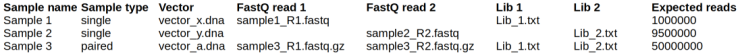
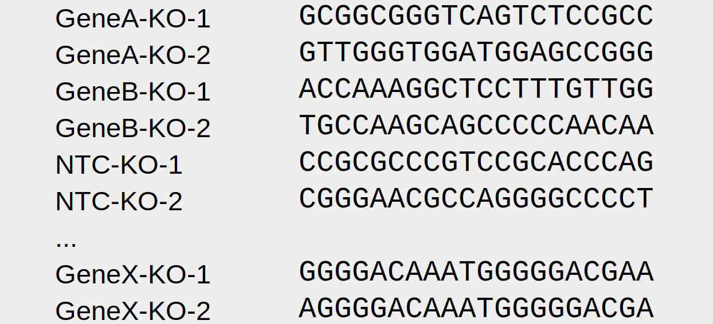

|LOGO|

|License|

ReCo!
=====

ReCo! finds gRNA read counts (ReCo) in fastq files and runs as a standalone script or a python package. It can be used for single and combinatorial CRISPR-Cas libraries that have been
sequenced with single-end or paired-end sequencing strategies. ReCo works with conventionally cloned CRISPR-Cas libraries and 3Cs_/3Cs-MPX_ libraries.

Provided with only a sample sheet and gRNA sequences, ReCo can process multiple samples in a single run. It automatically
determines the constant regions flanking
the gRNAs, and utilizes Cutadapt_ to trim the fastq files. To determine the abundance of each gRNA, the resulting sequences are aligned to the gRNA library using
Bowtie2_.

If ReCo! is additionally provided with an appropriate 3Cs or 3Cs-MPX template vector map (, e.g., in Snapgene_ format or as a .fasta file), it
automatically quantifies the abundance of the restriction enzyme recognition site of the template placeholder sequence.

ReCo! provides the read counts as a .csv file and generates a graphical summary of library statistics in .pdf and .png format.
For trouble shooting of unexpected results, ReCo provides detailed log files and reports all sequences that did not align to the library.

ReCo was developed by Martin Wegner in Prof. Manuel Kaulich's group (GEG_) at the Institute of Biochemistry II (IBCII_) in the Hospital of the Goethe University, Frankfurt am Main, Germany and is available under the terms of the MIT license.

Requirements
------------

ReCo! was developed on Ubuntu 20.0.4 LTS using Python 3.8. To set up Python3 on your machine, please visit the Python3 documentation_  and
follow the installation instructions.
Trimming is performed with Cutadapt_ 2.8 which is included in Ubuntu
distributions and was therefore used for fastq trimming.
Aligning the fastq sequences to your gRNA library of interest is performed with Bowtie2_ 2.3.0. Newer versions seem to produce
unexpected results. I am currently looking into this.

Both, cutadapt and Bowtie2, must be available from the system PATH.

How to cite
-----------

If you use ReCo!, please cite Cutadapt, Bowtie2, and ReCo!:

Cutadapt: https://doi.org/10.14806/ej.17.1.200

Bowtie2: https://doi.org/10.1038/nmeth.1923

ReCo!: https://academic.oup.com/bioinformatics/article/39/8/btad448/7229558

------------------------------------------

.. contents:: Table of Contents

------------------------------------------

Installation
------------

Install directly from GitHub but make sure to have Cutadapt 2.8 and Bowtie2 2.3.0 available on your system:

``pip install git+https://github.com/MaWeffm/reco.git#egg=reco``

Usage
-----
ReCo works both as a script that can be invoked from the command line and as a python package.

Standalone script
~~~~~~~~~~~~~~~~~
Use ReCo from the command line:

.. code:: sh

	$ ReCo cli --s sample_sheet.xlsx --o /home/user/ReCo_output/ -j 15 -r

``--s``: path to the sample sheet (required)

``--o``: path to output dir (required)

``-j 15``: use 15 cores (optional, default is 1)

``-r``: remove all intermediate files upon successful termination (optional, default is True)

Python package
~~~~~~~~~~~~~~
Import ReCo in Python and print its version:

.. doctest:: ignored

	>>> import reco
	>>> reco.__version__
	'0.0.1'

Create a ReCo object, provide a sample sheet file, an output dir, set logging and multiprocessing options. Run and remove all unnecessary files:

.. doctest:: ignored

	>>> r = reco.ReCo(sample_sheet_file="sample_sheet.xlsx", output_dir="/home/user/reco_output/")
	>>> r.run(remove_unused_files=True, cores=15)
	2022-08-22 20:49:34 INFO: Starting ReCo 0.0.1 at 2022-08-22 20:49:34
	2022-08-22 20:49:35 INFO: Sample 1: OK!
	2022-08-22 20:49:35 INFO: Sample 2: OK!
	2022-08-22 20:49:35 INFO: Sample 3: OK!
	2022-08-22 20:49:35 INFO: Sample 4: OK!
	...
	2022-08-22 21:22:23 INFO: Finished: 2022-08-22 21:22:23 (in: 0:32:48.165831)

Input
-------------
Sample sheet
~~~~~~~~~~~~
The sample sheet contains all samples and can be in .xlsx, .csv, .tsv., or .txt format. In .csv files, the field separator must be a comma.
In .tsv and .txt files the field separator must be a tab (\\t).

|sample_sheet|

The first row of the sample sheet file must be a header shown as above. After that, each row represents a sample. The first column (Sample name) contains the sample name. Try to use meaningful names, your future you
will be grateful! The second column (Sample type) contains the type of sample. A single sample requires one fastq file and one library file.
A paired sample requires two fastq files as a result from paired-end sequencing, and two library files. The third
column (Vector) contains the path to a vector file in one of the following formats: .dna, .gb, .gbk., .fa, .fasta, or .txt.
The 4. and 5. columns (FastQ read 1, FastQ read 2)contain paths to fastq files. The fastq files can be read compressed (.fasta.gz) or uncompressed (.fasta).
For a sample of type single, use one of the columns only.
The 6. and 7. columns (Lib 1, Lib 2) contain paths to library files in one of the following formats: .xlsx, .csv, .tsv, .txt.
For a sample of type single, use one of the columns only.
The 8. column (Expected reads) contains the expected number of reads. The last column (Emails) can optionally contain a list of email addresses to which the
results are send.

Library
~~~~~~~
The library file contains all gRNA sequences for a sample.

|library|

It must not contain a header. Each row represents a gRNA. The first column contains the unique gRNA name. The second column contains
the gRNA sequence. All gRNA sequences must be notated in the same direction (forward or reverse).
In case of duplicated names or sequences, ReCo will automatically keep only the first occurrence and log a warning.

Optional: Vector
~~~~~~~~~~~~~~~~~~~~~
The vector file is optional and contains template vector information in one of the following formats: .dna (Snapgene_), .fasta, .fa, .gb, .gbk, or .txt.
If a vector file is provided, ReCo assumes that this is a 3Cs template vector and tries to find the template restriction enzyme recognition site to quantify its abundance (see 3Cs_ and 3Cs-MPX_ for details).
If a DNA sequence is provided containing the letters A, C, G, and T, ReCo will try to find template information in this sequence.
If left empty, ReCo assumes that the library was generated conventionally and skips determining the template sequence from the vector file.

Output
------
ReCo generates a log file in the specified output folder summarizing all runs:

* ``/output_dir/reco_date.log``

For each sample, ReCo creates a sub folder in the specified output folder and generates multiple result files:

* ``/output_dir/sample_name/report.txt``

  Provides a summary of all important parameters and trimming/alignment rates.

* ``/output_dir/sample_name/ReCo_[samplename].log``

  A detailed logfile containing all parameters, settings, outputs (also from cutadapt and Bowtie2). Helpful for trouble shooting in case of unexpected results.

* ``/output_dir/sample_name/[samplename]_final_guidecounts.csv``

  This is the file containing the read counts for all library gRNAs or gRNA combinations of two libraries.

* ``/output_dir/sample_name/[samplename]_failed_gRNAs.csv``

  This file contains all sequences that ReCo could not align to the library. Helpful for trouble shooting.

* ``/output_dir/sample_name/[samplename]_top100_failed_sequences.csv``

  This file contains only the top 100 of sequences that ReCo could not align to the library. This is a small file that is useful for quick trouble shooting.
  If trimming or alignment rates are low, try to align these sequences to other libraries or double check the homology sequence that ReCo determined from your fastq files.

* ``/output_dir/sample_name/[samplename]_qc_panel.pdf`` and ``[samplename]_qc_panel_png``

  These two files contain a plot panel visualizing properties of the sequenced library.

Links
-----
* `Source code <https://github.com/MaWeffm/ReCo/>`_
* `Report an issue <https://github.com/MaWeffm/ReCo/issues>`_

License
-------

|License|

.. _documentation: https://www.python.org/downloads/
.. _Cutadapt: https://cutadapt.readthedocs.io/en/v2.8/
.. _Bowtie2: http://bowtie-bio.sourceforge.net/bowtie2/index.shtml
.. _3Cs: https://elifesciences.org/articles/42549
.. _3Cs-MPX: https://academic.oup.com/nar/article/49/10/5684/6270805
.. _Snapgene: https://www.snapgene.com/
.. _GEG: https://biochem2.com/research-group/gene-editing/
.. _IBCII: https://biochem2.com/
.. |License| image:: https://img.shields.io/badge/License-MIT-yellow.svg
   :target: https://raw.githubusercontent.com/MaWeffm/ReCo/master/LICENSE
